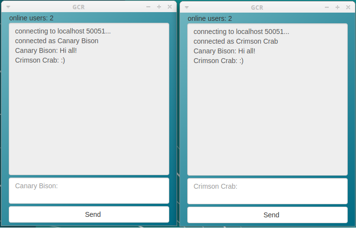

# GCR - grpc chat room

A chat server implemented with [gRPC](https://grpc.io) in Go.
Client gui application based on [lorca](https://github.com/zserge/lorca).

## Installation

Installation requires the Go toolchain, the [`protoc` compiler](https://github.com/google/protobuf), the [`protoc-gen-go` plugin](https://github.com/golang/protobuf) and the Chrome/Chromium to be installed.

```bash
go get github.com/faroyam/gcr
./build.sh
```

## Usage

```bash
$ ./client -h
Usage of ./client:
  -a string
        server ip address (default "localhost")
  -p string
        port number (default "50051")
  -t    enable tls ecryption

$ ./server -h
Usage of ./server:
  -p string
        port number (default "50051")
  -t    enable tls ecryption
```



To establish an encrypted connection, create a certificate and a key by executing [make_certs.sh](make_certs.sh) command and specifying your personal data
